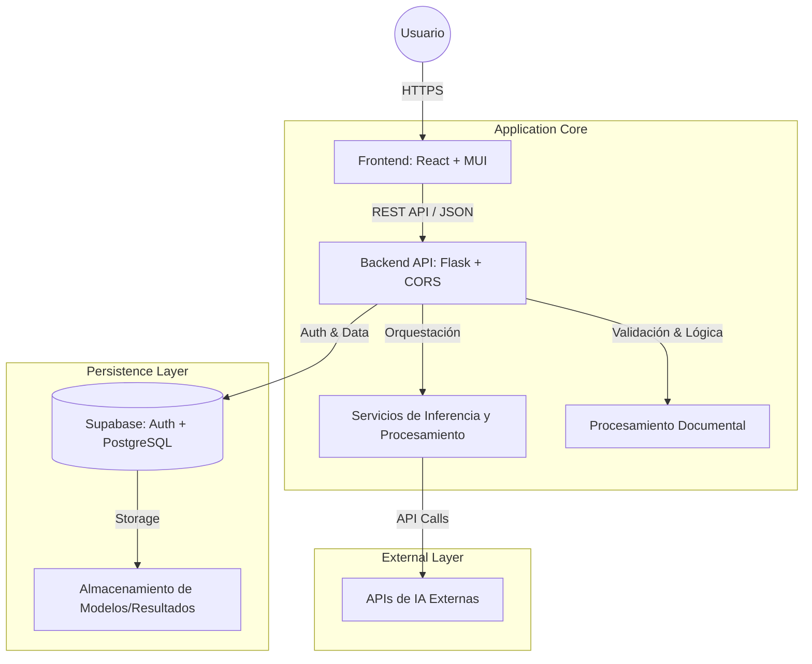

# Arquitectura del Sistema

Promplab está diseñado como una plataforma SaaS modular, orientada a flujos de trabajo **no-code** y **human-in-the-loop**. La arquitectura desacopla estrictamente el frontend, backend, servicios de inferencia y persistencia, permitiendo escalabilidad horizontal, control granular de costos y alta reutilización de recursos.

## Diagrama de Alto Nivel

## Componentes del Sistema

### 🖥️ Frontend (Capa de Presentación)
*   **Stack:** React + Material UI (MUI).
*   **Filosofía:** Orientado a flujos guiados y visualización interactiva de datos complejos.
*   **Comunicación:** Consume exclusivamente endpoints del backend vía HTTP/REST. Mantiene una separación estricta entre presentación y lógica de negocio.
*   **Estado:** Gestión de estado organizada por módulo y recurso, permitiendo navegación fluida sin pérdida de contexto.

### ⚙️ Backend (Capa de Lógica)
*   **Stack:** Python (Flask) + Flask-CORS.
*   **Responsabilidad:** Orquestación de flujos, validación de entradas, seguridad y gestión de sesiones.
*   **Diseño:** Endpoints desacoplados por dominio funcional (e.g., `/cleaning`, `/training`, `/chat`). Actúa como el único punto de entrada seguro a los servicios de datos.

### 🧠 Servicios de Inferencia y Procesamiento
*   **Función:** Encapsulan la interacción con modelos de ML (Scikit-learn) y APIs externas (LLMs).
*   **Desacoplamiento:** Se mantienen separados del núcleo de la API para facilitar el escalado independiente y optimizar el uso de CPU/GPU según la demanda.

### 💾 Persistencia
*   **Proveedor:** Supabase (PostgreSQL).
*   **Datos:** Almacena metadatos de usuario, datasets procesados y binarios de modelos serializados.
*   **Seguridad:** La autenticación se valida en cada petición contra los servicios de Supabase antes de permitir operaciones en el backend.
