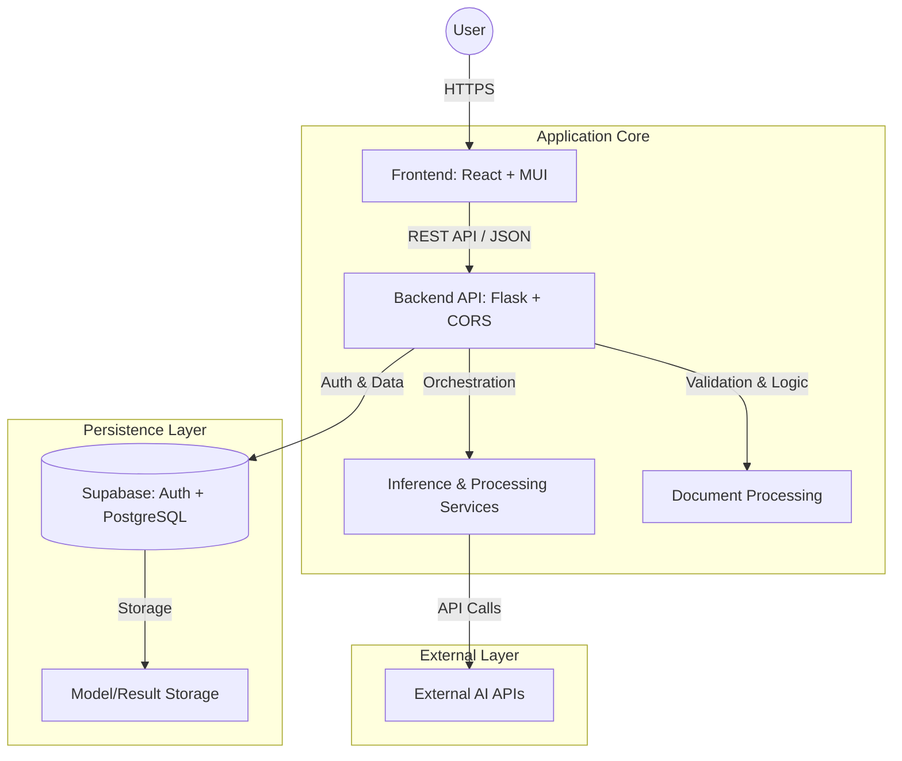

# System Architecture

Promplab is designed as a modular SaaS platform, oriented towards **no-code** and **human-in-the-loop** workflows. The architecture strictly decouples the frontend, backend, inference services, and persistence layers, enabling horizontal scalability, granular cost control, and high resource reusability.

## High-Level Diagram

## System Components

### 🖥️ Frontend (Presentation Layer)
*   **Stack:** React + Material UI (MUI).
*   **Philosophy:** Focuses on guided workflows and interactive visualization of complex data.
*   **Communication:** Exclusively consumes backend endpoints via HTTP/REST. Maintains a strict separation between presentation and business logic.
*   **State:** State management is organized by module and resource, allowing fluid navigation without context loss.

### ⚙️ Backend (Logic Layer)
*   **Stack:** Python (Flask) + Flask-CORS.
*   **Responsibility:** Workflow orchestration, input validation, security, and session management.
*   **Design:** Endpoints decoupled by functional domain (e.g., `/cleaning`, `/training`, `/chat`). Acts as the single secure entry point to data services.

### 🧠 Inference & Processing Services
*   **Function:** Encapsulate interaction with ML models (Scikit-learn) and external APIs (LLMs).
*   **Decoupling:** Kept separate from the core API to facilitate independent scaling and optimize CPU/GPU usage based on demand.

### 💾 Persistence
*   **Provider:** Supabase (PostgreSQL).
*   **Data:** Stores user metadata, processed datasets, and serialized model binaries.
*   **Security:** Authentication is validated against Supabase services on every request before allowing backend operations.